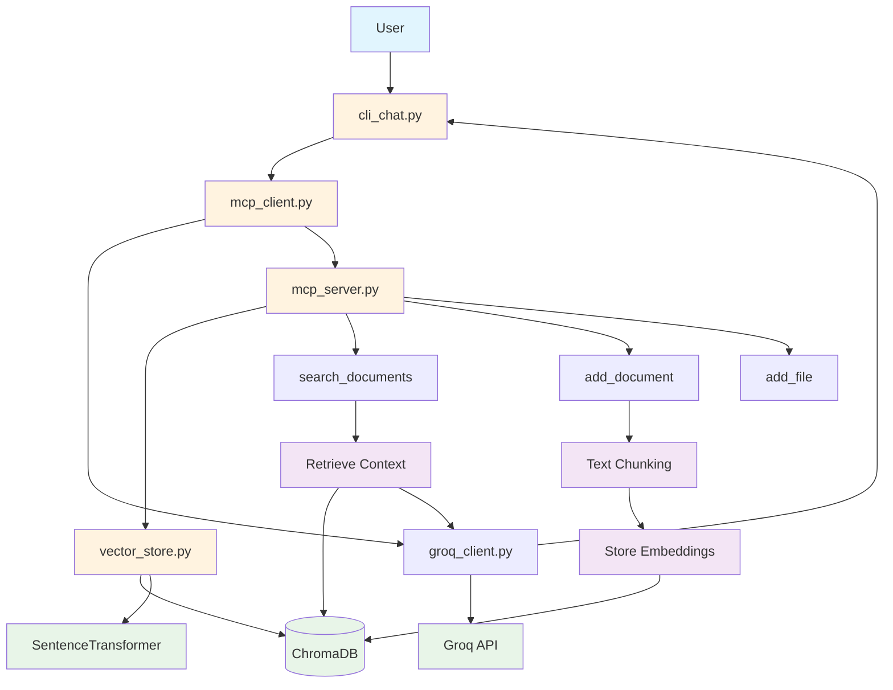

# RAG Chatbot with MCP Tools

A Retrieval-Augmented Generation (RAG) chatbot that uses MCP (Model Context Protocol) tools to interact with a ChromaDB vector store and Groq's Deepseek model.

## Features

- **Vector Store**: ChromaDB for document storage and similarity search
- **LLM**: Deepseek model via Groq API
- **MCP Tools**: FastMCP-based tools for document management and search
- **CLI Interface**: Simple command-line chat interface
- **Document Management**: Add documents, files, and search the knowledge base

## Setup

1. **Install Dependencies**:
   ```bash
   pip install -r requirements.txt
   ```

2. **Set up Environment**:
   ```bash
   cp .env.example .env
   # Edit .env and add your Groq API key
   ```

3. **Get Groq API Key**:
   - Sign up at [Groq](https://console.groq.com/)
   - Create an API key
   - Add it to your `.env` file

## Usage

### Start the Chat Interface

```bash
python cli_chat.py
```

### Available Commands

- `/help` - Show help message
- `/add` - Add a document to the knowledge base
- `/addfile` - Add a file to the knowledge base  
- `/search` - Search the knowledge base
- `/info` - Show collection information
- `/clear` - Clear conversation history
- `/quit` or `/exit` - Exit the chat

### Natural Chat

You can also just ask questions naturally. The AI will automatically:
- Search the knowledge base for relevant information
- Use that context to provide informed responses
- Invoke MCP tools as needed

## MCP Tools

The system includes these MCP tools:

- **search_documents**: Search for relevant documents
- **add_document**: Add new document content
- **add_file**: Add a file's content to the vector store
- **get_collection_info**: Get collection statistics
- **delete_document**: Remove documents from the store

## Testing

Run the test script to verify everything works:

```bash
python test_rag.py
```

## Architecture

- `vector_store.py`: ChromaDB integration and document management
- `mcp_server.py`: MCP server with RAG tools
- `groq_client.py`: Groq API client for Deepseek model
- `mcp_client.py`: MCP client and agent logic
- `cli_chat.py`: Command-line chat interface
- `test_rag.py`: Basic functionality tests



The system automatically manages the RAG pipeline, searching for relevant context when needed and providing informed responses based on your knowledge base.
